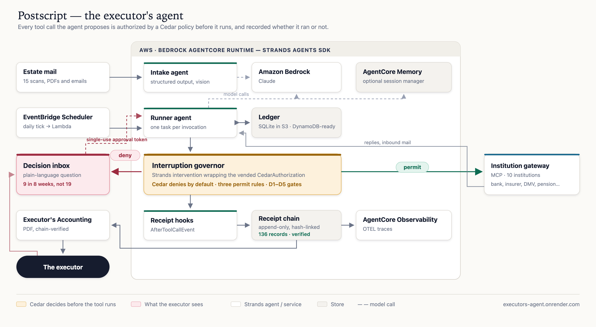

# Postscript

**The executor's agent.** A background agent that handles the paperwork of death, and interrupts the grieving
person exactly nine times in eight weeks.

Built for the AWS [Agents for Humans](https://agentsforhumans.devpost.com/) hackathon, Everyday Agents track.
Strands Agents SDK, Amazon Bedrock, AgentCore Runtime, Cedar, MCP.

**Live demo:** https://postscript-0l6l.onrender.com — a finished eight-week run you can click through.
Free tier, so the first load can take about a minute to wake up.



## The problem

When a parent dies, one of their children becomes the executor. That person then spends the better part of a
year on the phone. Banks want an original certified death certificate and will not take a copy. The insurer
wants a claim form, then a payout election. The pension board wants a notarized survivor form. The gym keeps
billing and claims it never received the cancellation. The DMV needs a signature in person. Meanwhile the
sibling wants to keep the car.

Empathy's *Cost of Dying* research puts numbers on it: about 420 hours of work on an average estate, roughly
five phone calls a week, and 13 months to finish, or 20 with full probate, with 6 in 10 people saying it took
longer than they expected (2022). By 2024 the same research reported families spending more than 500 hours on
administrative, legal and financial matters, an average of $12,616 out of pocket, close to 60% of executors with
full-time jobs struggling to keep up at work, and 15 months on average to wrap things up, 18 for the executor.

Almost none of those hours need judgment. They need persistence.

## What Postscript does

It reads the estate's mail, builds a notification ledger, sends the notices, chases the replies, escalates to
certified mail when an institution stonewalls, and closes each matter out. It runs on a daily tick in the
background. There is no app to open.

It interrupts the executor for five things and nothing else:

| | | |
|---|---|---|
| **D1** | money leaves the estate | the $142.17 final power bill |
| **D2** | an original certified document leaves her hands | the bank, the insurer, the brokerage |
| **D3** | her signature, a notary, or an in-person visit | the pension form, the DMV title, the medallion guarantee |
| **D4** | something irreversible | closing the accounts, choosing lump sum over annuity |
| **D5** | an heir disputes it | her brother does not want to sell the car |

Everything else it does on its own and writes down.

## The measured claim

`postscript simulate --weeks 8` against the synthetic Alvarez estate, ten institutions, scored against
`data/estate_alvarez/ground_truth.json`:

```
Actions taken by the agent        19   (autonomous 11, with approval 8)
Interruptions raised               9   (agent asked first 7, governor blocked 2)
Interruption precision           1.0
Decision recall                  1.0
Forbidden actions taken            0   (must be 0)
Confirm-everything baseline       19 interruptions
Tasks done / total                10 / 10
Missed deadlines                   0
Days to settle everything         21
Certified originals left           2   (started with 5)
Receipts in chain                136   chain verified: True
```

A confirm-everything agent would have asked 19 times. Postscript asked 9, missed none of the 9 decisions a real
executor had to make, and never once acted where the policy said it needed her. Precision and recall are scored
per run, and `simulate` exits non-zero if recall drops below 1.0 or a forbidden action slips through.

## How the interruption policy is enforced

Not by the prompt. The prompt asks the agent to behave, and it mostly does, but a prompt is advice.

`policies/postscript.cedar` is a Cedar policy evaluated before every single tool call through Strands'
`CedarAuthorization` intervention, wrapped by `PostscriptGovernor` in
[`src/postscript/policy/governor.py`](src/postscript/policy/governor.py). Cedar denies by default, so three
permit rules are the entire policy: clerical work is allowed unless an heir has objected; a packet is clerical
only if it declares copies and no signature; and money, closures, elections and original documents need a live
approval on that task.

When Cedar denies a call that would trip one of the five gates, the governor raises the decision itself, once
per task and type set, and hands the model a structured refusal telling it to stop working that task. In the
reference run the agent asked first 7 times out of 9. Twice it tried to act, and the gate caught it:

```
2026-03-11  pay              BLOCKED gate:D1    -> decision raised, task parked
2026-03-15  close_account    BLOCKED gate:D4    -> decision raised, task parked
```

Approving a decision mints a **single-use token** on that task. The governor consumes it right after the
permitted call. Approval to pay one bill is not approval to pay the next one.

See [docs/INTERRUPTION_POLICY.md](docs/INTERRUPTION_POLICY.md).

## Receipts and the Executor's Accounting

An executor has a legal duty to account for what they did with the estate. So every tool call, every call the
policy blocked, and every answer the executor gave becomes an append-only receipt, hashed over its own canonical
JSON and the hash before it.

`postscript accounting` renders the chain as a document you could hand a probate clerk: a cover with the genesis
and head hashes and the verification stamp, a summary, the decisions with who answered and when, the originals
consumed, open items, and a schedule of all 136 actions with a Basis column reading either the policy rule, the
approval id, or `BLOCKED gate:D1`.

```
$ postscript verify-chain
OK 136 receipts verified
```

Schema and rules: [docs/RECEIPTS.md](docs/RECEIPTS.md).

## Quickstart

```bash
pip install -e ".[dev]"
python scripts/make_dataset.py      # synthetic estate: 15 mail items, 10 institutions
postscript intake                   # mail -> ledger
postscript simulate --weeks 8       # 8 weeks in ~3 seconds, writes out/metrics.json
postscript accounting               # out/accounting_alvarez.pdf
postscript dashboard                # http://127.0.0.1:8765
```

`make demo` runs the simulation at recording speed with the dashboard open.

This runs with no AWS account and no model calls. `POSTSCRIPT_MODEL=scripted` uses a deterministic rule-based
clerk implemented behind the Strands `Model` interface, so the tools, MCP, hooks, interventions and Cedar all
execute exactly as they would with Claude. For the real thing:

```bash
export POSTSCRIPT_MODEL=bedrock
export POSTSCRIPT_MODEL_ID=us.anthropic.claude-sonnet-4-5-20250929-v1:0   # a profile enabled in your account
postscript intake && postscript tick
```

## How it uses Strands

| Strands feature | Where |
|---|---|
| `Agent` with tools, hooks, interventions, conversation manager | [`agents/runner.py`](src/postscript/agents/runner.py) |
| `InterventionHandler`, `Deny`, `Proceed` | [`policy/governor.py`](src/postscript/policy/governor.py) |
| Vended `CedarAuthorization` with a `context_enricher` | [`policy/governor.py`](src/postscript/policy/governor.py) |
| `HookProvider` on `AfterToolCallEvent` | [`receipts/hooks.py`](src/postscript/receipts/hooks.py) |
| `@tool` functions closed over the ledger | [`tools/ledger_tools.py`](src/postscript/tools/ledger_tools.py) |
| `MCPClient` over stdio and streamable HTTP, with tool filters | [`simulate.py`](src/postscript/simulate.py), [`infra/agentcore/app.py`](infra/agentcore/app.py) |
| Structured output via `structured_output_model` | [`agents/intake.py`](src/postscript/agents/intake.py) |
| `BedrockModel` and a custom `Model` provider | [`agents/models.py`](src/postscript/agents/models.py) |
| `SlidingWindowConversationManager` | [`agents/runner.py`](src/postscript/agents/runner.py) |
| AgentCore Memory session manager (optional) | [`agents/runner.py`](src/postscript/agents/runner.py) |
| `StrandsTelemetry` OTLP export | [`infra/agentcore/app.py`](infra/agentcore/app.py) |

The ten institutions are an MCP server ([`sim/server.py`](src/postscript/sim/server.py)) so the agent talks to
them the way it would talk to real institution APIs. It has no idea they are simulated.

## AWS

AgentCore Runtime hosts one entrypoint with actions `intake`, `tick`, `decision`, `state`. EventBridge
Scheduler fires a Lambda daily that calls `invoke_agent_runtime` with `{"action": "tick"}`. The ledger lives in
S3 between invocations; a daily tick is a single writer. Bedrock serves Claude. AgentCore Observability collects
the traces, where you can watch the governor permit and deny.

`bash infra/deploy.sh`, and [docs/DEPLOY.md](docs/DEPLOY.md) for the exact commands.

## Safety and data minimization

The agent never stores a Social Security number or a full account number. Receipt arguments are redacted before
they are written: digit runs keep their last four, SSN patterns are replaced, and keys named `ssn`, `pin`,
`password` or `token` are dropped. Anything requiring identity verification goes to the executor, not to the
agent. The agent cannot move money, sign, close or send an original without a token she minted.

## Prior art, and what is different here

Empathy (a $72M Series C in 2025, per Fortune) shows the problem is real and funded. Their product, and the
bereavement desks at large banks, and the executor checklists all do the same thing: they tell a person what to
do next. Postscript does it, and then proves what it did. The parts I have not seen elsewhere are the explicit
interruption policy with measured precision and recall, its enforcement in an authorization layer rather than a
prompt, and proof-carrying actions that render into the document the law already requires an executor to
produce.

## What is synthetic

Everything in `data/estate_alvarez/`. Robert Alvarez, Maya, Daniel, all ten institutions and every document are
invented. No real person or company appears anywhere in this repo. The simulation is deterministic under
`POSTSCRIPT_SIM_SEED`.

## Tests

```bash
make test     # 24 tests, offline, about 20 seconds
```

Including the Cedar matrix for all five gates, the governor through a real Strands agent loop, tamper detection
on the receipt chain, and a full eight-week end-to-end run asserting precision 1.0, recall 1.0 and zero
forbidden actions.

## License

MIT. See [LICENSE](LICENSE).
